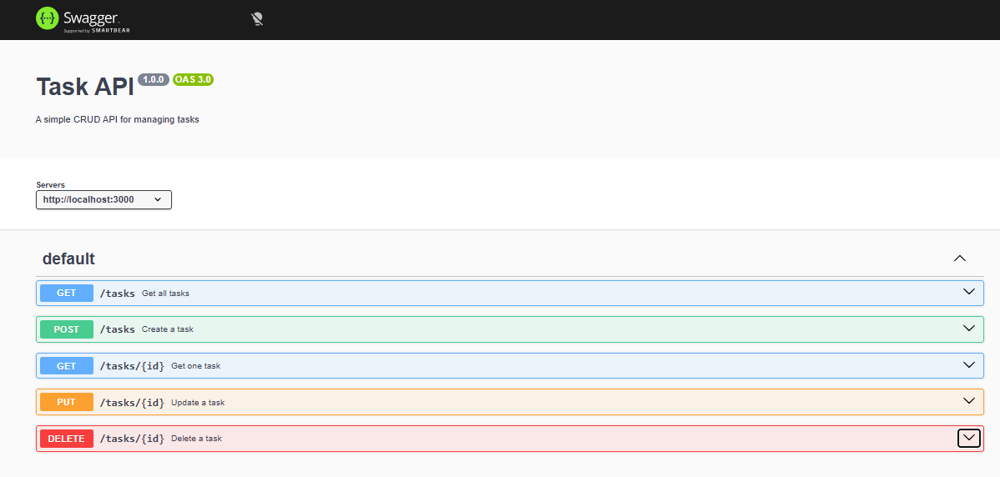

# CRUD Task API

A simple REST API for managing a to-do list, built with Node.js and Express.

## Features

- Create tasks
- Read all tasks
- Read a single task
- Update tasks
- Delete tasks
- Input validation
- JSON error responses
- Swagger UI documentation

## Technologies

- Node.js
- Express
- Swagger UI Express

## How to Run

Install the dependencies:

npm install

Start the server:

node server.js

The server will run at:

http://localhost:3000

## Swagger UI

Once the server is running, open:

http://localhost:3000/docs

Swagger UI provides an interactive way to view and test all API endpoints using "Try it out".

## API Endpoints

| Method | Endpoint | Description |
|---|---|---|
| GET | /tasks | Get all tasks |
| GET | /tasks/:id | Get one task |
| POST | /tasks | Create a new task |
| PUT | /tasks/:id | Update a task |
| DELETE | /tasks/:id | Delete a task |

## Example

Create a new task using curl:

curl -i -X POST http://localhost:3000/tasks -H "Content-Type: application/json" -d "{\"title\":\"Buy milk\"}"

A successful request returns:

201 Created

Example response:

{
  "id": 4,
  "title": "Buy milk",
  "done": false
}

## Status Codes

| Status Code | Meaning |
|---|---|
| 200 | Successful request |
| 201 | Task created |
| 204 | Task deleted |
| 400 | Invalid input |
| 404 | Task not found |

## Data Storage

Tasks are stored in an in-memory JavaScript array. No database is used in this version of the project, so the tasks reset when the server restarts.

## Swagger Screenshot

